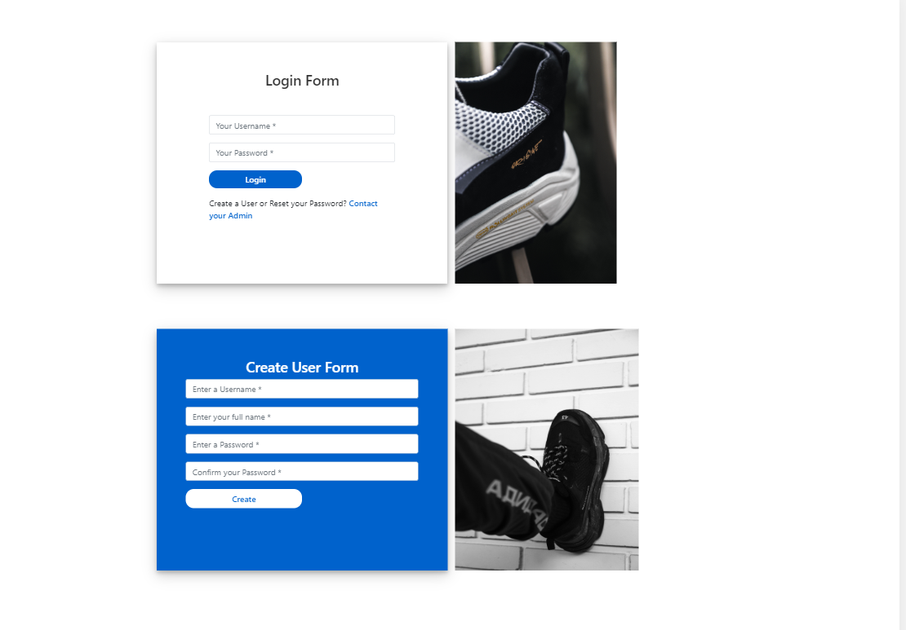

# Login-Register-Validation
A simple application that creates and validates user name and password. The application also restores the session so the user won't log in again if the browser is accidentally closed. The password are encrypted on the database for security purposes.

## Dependencies
* npm install
* npm i express
* npm i express-session
* npm i pug
* npm i bcrypt
* npm i util.promisify
* npm i mysql
* npm i nodemon

## Demo

---> <a href="https://drive.google.com/file/d/1cuw99cYagg9yl8ec8RHETv_KmBBBX7ZB/view">Click here for a video demo</a> <-----
